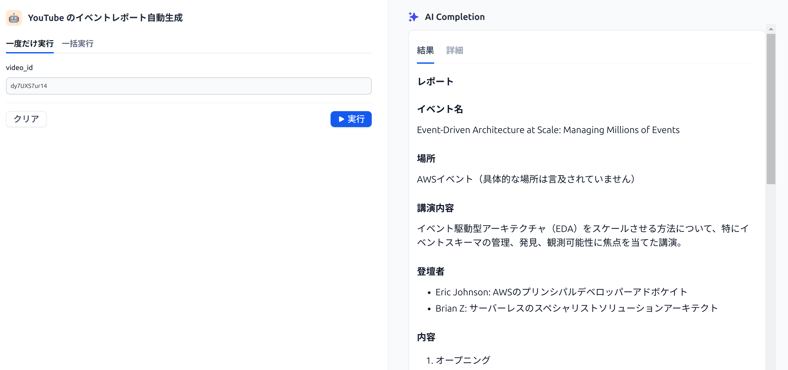
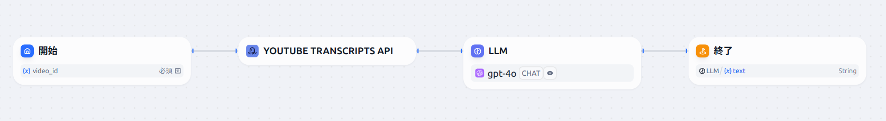

# YouTube のイベント動画をレポーティングするアプリ

## 概要
YouTube のイベント動画をもとに、イベントレポートを自動生成します。

## 特徴
- YouTube の動画 ID を入力すると、イベントレポートを出力します。
- イベントレポートは、動画の字幕に基づいて作成します。
- Dify を利用したアプリになっていて、UI がシンプルであり、さらにデプロイが簡単です。

## 利用シーン
- イベントの参加レポートをつくりたい。
- レポート作成の時間が取れない。
- YouTube にイベント動画がアップされている。

## 使い方
**入力**：YouTube 動画の ID を入力してください。
- YouTube 動画の ID は URL の `v=` 以降の11桁の文字列です。
- `https://www.youtube.com/watch?v=dy7UXS7ur14` なら動画 ID は `dy7UXS7ur14` です。

**出力**：レポート。



出力の例として、この `REDME.md` の末尾に出力の全文を掲載しています。

## 導入
- Dify を使ったアプリになっています。
- Dify はプログラミングの知識がなくても簡単にアプリ開発ができるノーコード自動化 AI ツールです。

### 構成



### 前提
下記のサービスを利用します。

- Dify
    - プログラミングの知識がなくても簡単にアプリ開発ができるノーコード自動化 AI ツールです。
    - 有料プランがあります。
    - [公式ページ](https://dify.ai/pricing)
- OpenAI API
    - OpenAI が提供するモデルを利用できます。
    - 有料プランがあります。
    - [公式ページ](https://openai.com/api/pricing/)
- Search API
    - Google検索、Google Jobs、YouTube、Googleニュースなどの検索エンジンから構造化データを提供する強力なリアルタイムの API です。
    - 有料プランがあります。
    - [公式ページ](https://www.searchapi.io/)

### デプロイ
ここでは Dify の公式ページからデプロイする方法を紹介します。

1. アカウント作成
    - [公式ページ](https://dify.ai/) にアクセスして、 「始める」ボタンからアカウントを作成します。
2. ワークフローの作成
    - ホーム画面が開き「アプリを作成する」の欄に表示されている「DSL ファイルをインポート」を選択します。
    - この README.md が配置されたリポジトリの `youtube_event_reporting.yaml` を指定する。

## レポーティングの例
YouTube 動画 ID `dy7UXS7ur14` を入力したときの出力例。

```
# レポート

## イベント名
Event-Driven Architecture at Scale: Managing Millions of Events

## 場所
AWSイベント（具体的な場所は言及されていません）

## 講演内容
イベント駆動型アーキテクチャ（EDA）をスケールさせる方法について、特にイベントスキーマの管理、発見、観測可能性に焦点を当てた講演。

## 登壇者
- Eric Johnson: AWSのプリンシパルデベロッパーアドボケイト
- Brian Z: サーバーレスのスペシャリストソリューションアーキテクト

## 内容

1. オープニング
   - Eric Johnsonが自己紹介し、Brian Zを紹介。
   - イベント駆動型アーキテクチャ（EDA）についての情熱を共有。

2. スケールとは何か
   - スケールの定義は人によって異なるが、一般的にはトラフィックの増加を指す。
   - AWSのサービス（DynamoDB、Lambdaなど）が高トラフィックを処理する能力を持つことを強調。

3. イベント駆動型アーキテクチャ（EDA）の定義
   - EDAは「何かが起こり、それに反応する」こと。
   - イベントはシステムの状態変化を示す信号であり、変更不可能（イミュータブル）。

4. スキーマ管理
   - スキーマ管理の重要性と、スキーマがプロデューサーとコンシューマー間の契約であることを説明。
   - JSONスキーマを使用したスキーマの検証方法を紹介。

5. スキーマの進化とバージョン管理
   - スキーマのバージョン管理の方法を説明。
   - 新しいバージョンのスキーマが導入された際のダブルパブリッシュ戦略。

6. スキーマの発見と管理
   - イベントスキーマの発見と管理のためのツール（AWSサービスカタログ、Backstage、AsyncAPI、Event Catalog）を紹介。

7. 観測可能性
   - イベントブリッジのメトリクスを使用した観測可能性の向上方法。
   - プロデューサーとコンシューマー間の非同期通信を維持しつつ、エラーを検出する方法。

8. クロージング
   - EDAのスケールにおける重要なポイントをまとめ、参加者に感謝の意を表明。
```
